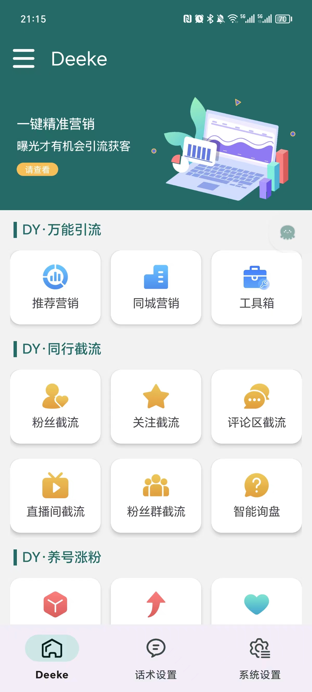
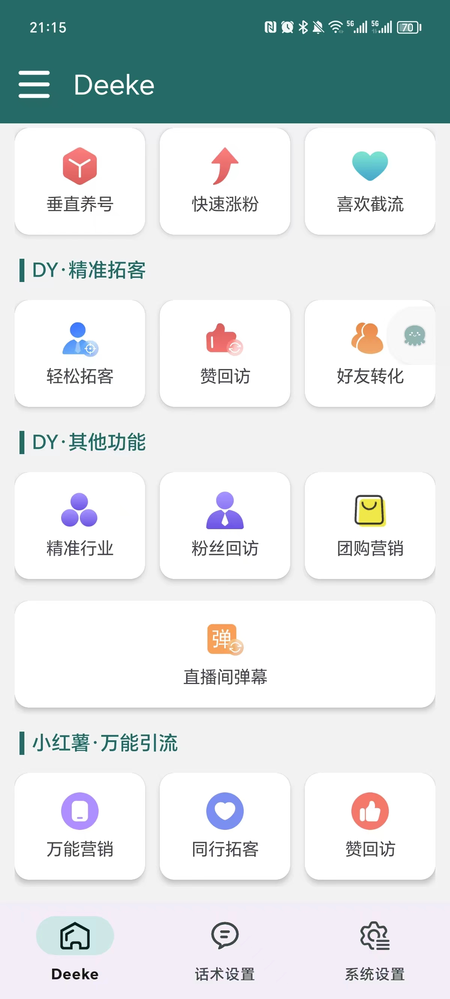
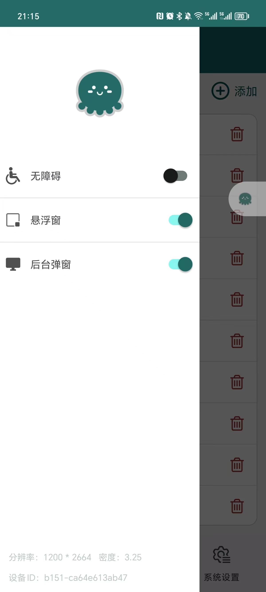
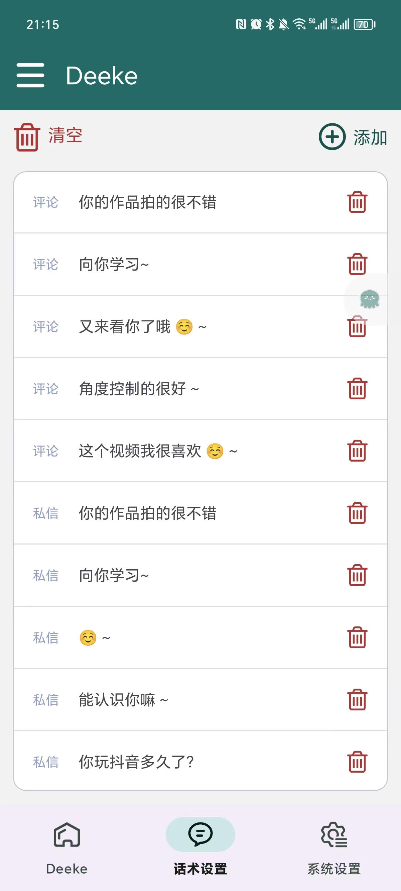
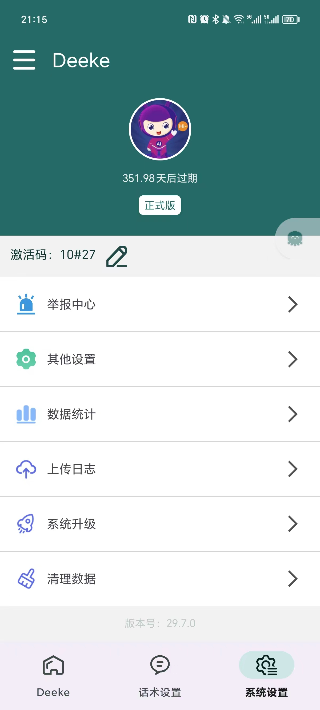
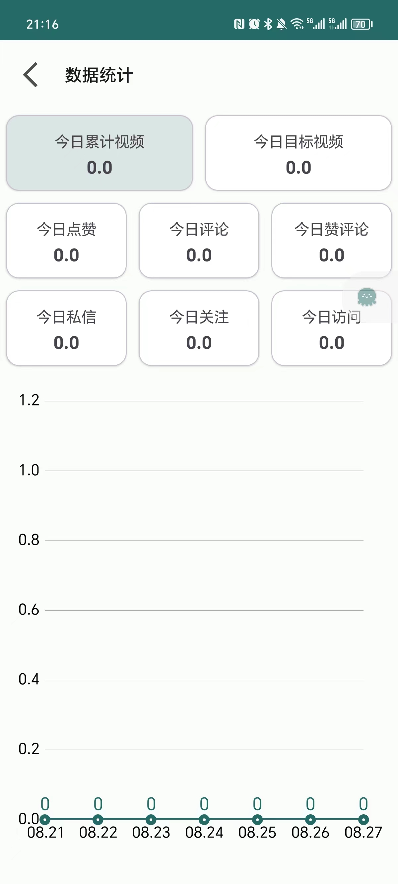
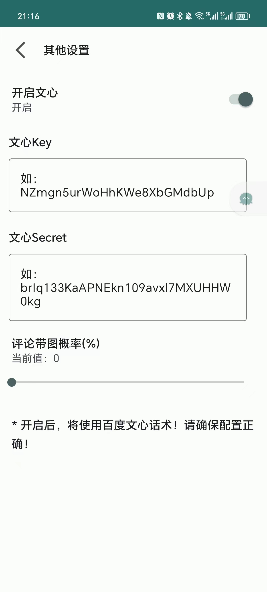
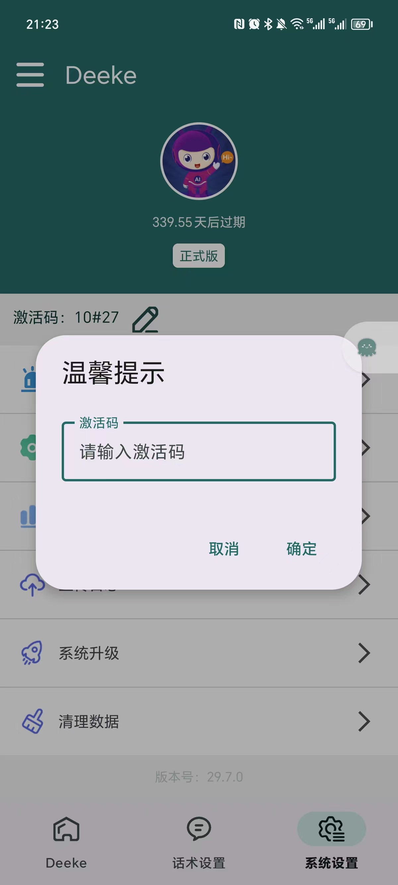

#  Deeke抖音智能营销助手

#### 软件简介

Deeke抖音智能营销助手是一款基于Android无障碍技术的自动化操作工具，专为抖音用户设计，旨在通过自动化操作来实现高效的引流与客户互动。它模拟人工操作抖音平台上的各种功能，如点赞、评论、关注、私信和赞头像等，帮助您以更低的成本、更高的效率在抖音上吸引潜在客户并提升品牌曝光度。软件最新版本支持角色功能（比如你可以把软件设置为心理医生角色，软件将会根据心理医生的角色对视频进行评论）

---

> 我们具备定制和二开能力，本软件可贴牌（OEM），【<a href="#bottom">联系我们，请滑动到文末</a>】

#### Deeke软件截图

#### 核心功能

1. **自动点赞**：
   - 模拟人工点赞操作，自动为目标用户的内容进行点赞，增加互动几率。
   - 支持批量点赞，短时间内大幅度提升内容曝光率。

2. **自动评论**：
   - 自动在目标用户的内容下方发布个性化评论，拉近与潜在客户的距离。
   - 支持评论模板定制，确保评论内容多样性且不易被检测为机器人。

3. **自动关注**：
   - 自动关注目标用户，增加用户对您的兴趣并提升品牌的曝光机会。
   - 根据用户的互动行为智能选择关注对象，提升精准度。

4. **自动私信**：
   - 自动向目标用户发送私信，直接进行一对一沟通，快速建立客户联系。
   - 支持批量私信，提升推广效率，扩大影响范围。

5. **自动点赞头像**：
   - 自动为目标用户的头像点赞，提升互动的趣味性和新颖性，吸引用户回访。

6. **其他**

---

#### 软件优势

1. **高效引流**：
   - 抖音智能营销助手能够7×24小时不间断工作，远超人工操作效率，帮助您快速扩展潜在客户群体。

2. **精准营销**：
   - 通过智能算法筛选高质量目标用户，确保您的每一次互动都是有价值的，从而最大化推广效果。

3. **降低成本**：
   - 减少人工操作的时间和费用支出，将资源集中在更有价值的客户转化上，降低整体营销成本。

4. **操作便捷**：
   - 简单易用的界面设计，即使是非技术人员也可以轻松上手。支持一键启动、实时监控、操作日志记录等功能，随时掌握营销动态。

5. **安全稳定**：
   - 基于Android无障碍技术，模拟真实的用户操作，降低被抖音平台检测到的风险。软件经过多轮测试，运行稳定可靠。

---

#### 解决客户问题

1. **提升品牌曝光**：
   - 自动化的点赞、评论和关注操作，帮助品牌在短时间内获得大量曝光，吸引更多关注者。

2. **增加用户互动**：
   - 智能评论和私信功能能够直接与用户进行互动，拉近品牌与用户之间的距离，提升用户黏性。

3. **拓展客户群体**：
   - 针对潜在客户的自动化营销，帮助品牌快速扩大客户群体，并推动潜在客户转化为实际用户。

4. **提高推广效率**：
   - 无需人工重复操作，自动化流程能够在短时间内高效执行多个任务，确保推广活动快速见效。

---

#### 我们的优势
* 软件自主研发，采用DeekeScript底层框架（<a href="https://doc.deeke.top" target="_blank">点击查看</a>）
* 具备定制APP能力，可贴牌、可扩展功能；也可开发其他平台功能
* 因为采用自主开发的DeekeScript框架，所以稳定性更好
* 软件开箱即用，无需过多繁琐流程，让市场推广更加便利
* 无需过多的学习成本

---

#### 结语

抖音智能营销助手通过智能化、自动化的方式，将抖音上的常规营销操作高度集成，极大地提升了营销效率和客户转化率。它不仅是您拓展客户资源的利器，更是提升品牌曝光度和影响力的关键工具。让我们一起迈向更高效的营销新时代！

---

#### 联系我们

---

